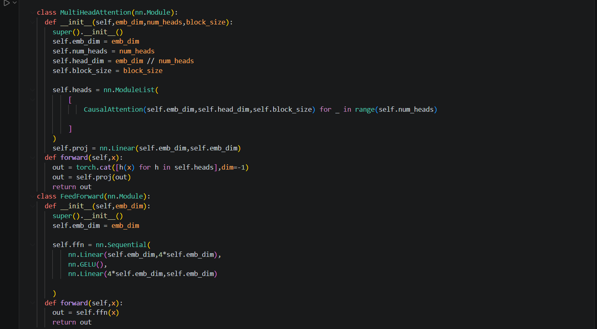
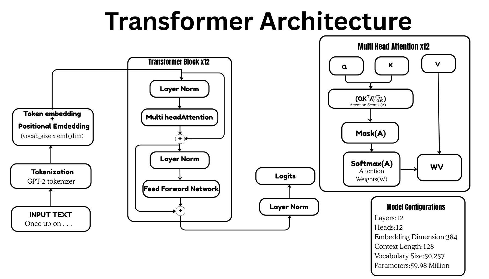
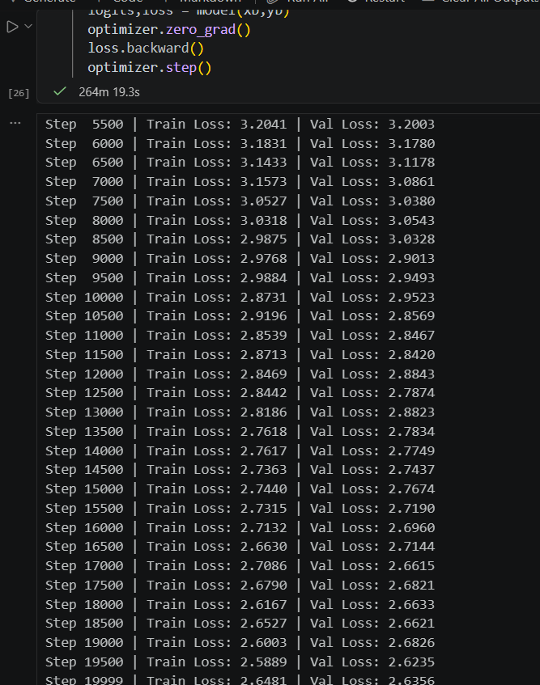
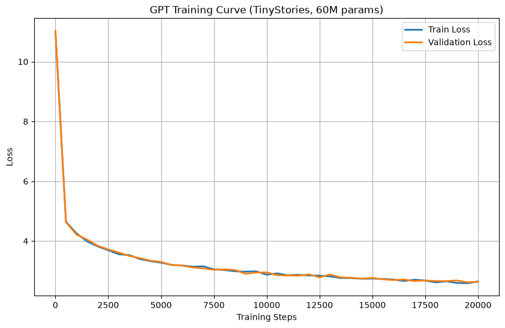
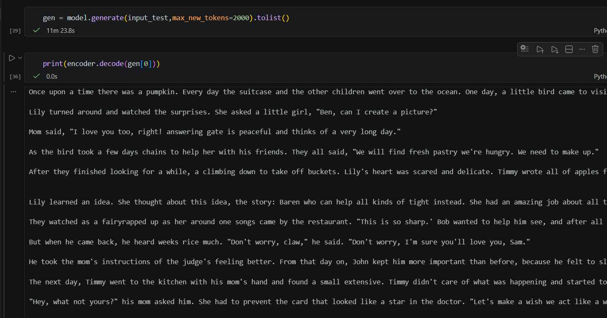

# GPT-From-Scratch 🚀

<p align="center">
  
</p>

<p align="center">
  <strong>A complete implementation of a GPT-style Decoder-Only Transformer built entirely from scratch using PyTorch.</strong>
</p>

<p align="center">
  Built without Hugging Face Transformers or any pre-built GPT implementation.
</p>

---

## 📖 Overview

This project implements a **GPT-style Decoder-Only Transformer** completely from scratch using **PyTorch**. Every major component of a modern autoregressive language model has been implemented manually—from tokenization and dataset preprocessing to multi-head causal self-attention, transformer blocks, training, and text generation.

The goal of this project is to understand how Large Language Models (LLMs) work internally by building every component rather than relying on existing model implementations.

The model was trained on the **TinyStories** dataset and successfully learns story structure, dialogue, and narrative flow while generating coherent short stories.

---

# ✨ Features

* ✅ Built completely from scratch using PyTorch
* ✅ Decoder-Only Transformer architecture
* ✅ Multi-Head Causal Self-Attention
* ✅ Learned Token Embeddings
* ✅ Learned Positional Embeddings
* ✅ Pre-Layer Normalization
* ✅ Residual Connections
* ✅ Feed Forward Network (4× Expansion + GELU)
* ✅ Causal Attention Masking
* ✅ GPT-2 Tokenizer (`tiktoken`)
* ✅ Memory-Mapped Dataset Loading (`numpy.memmap`)
* ✅ TinyStories Dataset Training
* ✅ Autoregressive Text Generation

---

# 🧠 Model Architecture

<p align="center">
  
</p>

The model follows the standard **GPT Decoder-Only Transformer** architecture.

```
Input Tokens
      │
      ▼
Token Embedding
      +
Position Embedding
      │
      ▼
Transformer Block × 12
      │
      ▼
Final LayerNorm
      │
      ▼
Linear Head
      │
      ▼
Vocabulary Logits
```

Each transformer block consists of:

* Layer Normalization
* Multi-Head Causal Self-Attention
* Residual Connection
* Feed Forward Network
* Residual Connection

---

# 📊 Model Configuration

| Hyperparameter      |             Value |
| ------------------- | ----------------: |
| Parameters          | **59.98 Million** |
| Layers              |                12 |
| Attention Heads     |                12 |
| Embedding Dimension |               384 |
| Context Length      |               128 |
| Batch Size          |                 3 |
| Optimizer           |             AdamW |
| Learning Rate       |              1e-4 |
| Loss Function       |     Cross Entropy |
| Training Iterations |            20,000 |

---

# 📂 Dataset

The model was trained using the **TinyStories** dataset.

Due to GitHub file size limitations, the dataset is **not included** in this repository.

Download the TinyStories CSV dataset from Kaggle and place it inside the following directory:

```
dataset/
├── train.csv
└── validation.csv
```

Both CSV files should contain a single column named:

```
text
```

Example:

```
text
-----------------------------------------
Once upon a time...
A little rabbit...
There was a small bird...
```

The dataset is tokenized using the GPT-2 tokenizer (`tiktoken`) and converted into binary memory-mapped files (`train.bin` and `validation.bin`) for efficient loading during training.

---

# ⚙️ Data Pipeline

```
CSV Dataset
      │
      ▼
Remove Empty Rows
      │
      ▼
GPT-2 Tokenization
      │
      ▼
Token IDs
      │
      ▼
Memory-Mapped Binary Files
      │
      ▼
Random Context Sampling
      │
      ▼
Training Batches
```

---

# 🏗 Components Implemented

## Embedding Layer

* Learned Token Embeddings
* Learned Positional Embeddings

---

## Multi-Head Causal Self-Attention

Implemented manually using:

* Query Projection
* Key Projection
* Value Projection
* Scaled Dot Product Attention
* Causal Attention Mask
* Softmax Attention
* Output Projection

---

## Feed Forward Network

```
Linear
   │
   ▼
GELU
   │
   ▼
Linear
```

Expansion:

```
Embedding Dimension
        │
        ▼
4 × Hidden Size
        │
        ▼
Embedding Dimension
```

---

## Transformer Block

Each transformer block contains:

```
LayerNorm
      │
      ▼
Multi-Head Attention
      │
      ▼
Residual Connection
      │
      ▼
LayerNorm
      │
      ▼
Feed Forward Network
      │
      ▼
Residual Connection
```

A total of **12 transformer blocks** are stacked to build the model.

---

# 📈 Training Results

### Hardware

* GPU: **NVIDIA RTX 4050**

### Training Configuration

* Training Iterations: **20,000**
* Optimizer: **AdamW**
* Learning Rate: **1e-4**

---

## Final Loss

| Metric          |      Value |
| --------------- | ---------: |
| Train Loss      | **2.6481** |
| Validation Loss | **2.6356** |

---

## 📜 Training Log

<p align="center">
  
</p>

The model was evaluated periodically during training to monitor both training and validation loss.

---

## 📉 Loss Curve

<p align="center">
  
</p>

The loss curves demonstrate stable convergence throughout training with closely matching training and validation losses, indicating good generalization.

---

# ✍ Sample Generation

### Prompt

```text
Once upon a time there was a pumpkin
```

### Generated Output

<p align="center">
  
</p>

Example excerpt:

```text
Once upon a time there was a pumpkin.

Every day the suitcase and the other children went over to the ocean.

One day, a little bird came to visit Lily's room.

The bird was scared and said,

"Don't worry, you'll help me find my boat."

Lily turned around and watched the surprises...
```

Although the model occasionally produces repetitive or nonsensical text—which is expected for a 60M parameter model trained with a relatively short context length—it successfully learns story structure, dialogue, and narrative flow from the TinyStories dataset.

---

# 🚀 Running the Project

## Clone the Repository

```bash
git clone https://github.com/yourusername/GPT-From-Scratch.git

cd GPT-From-Scratch
```

---

## Install Dependencies

```bash
pip install torch
pip install datasets
pip install numpy
pip install tiktoken
```

---

## Prepare the Dataset

Download the TinyStories CSV dataset and place it inside:

```
dataset/
├── train.csv
└── validation.csv
```

---

## Train the Model

Run all notebook cells sequentially.

The notebook performs:

* Dataset loading
* Data preprocessing
* Tokenization
* Binary dataset creation
* Model initialization
* Training
* Evaluation
* Text generation

---

# 📁 Project Structure

```
GPT-From-Scratch/
│
├── assets/
│   ├── architecture.png
│   ├── code.png
│   ├── generated_output.png
│   ├── log.png
│   └── loss_curve.png
│
├── dataset/
│   ├── train.csv
│   └── validation.csv
│
├── train.bin
├── validation.bin
├── GPT_From_Scratch.ipynb
├── README.md
└── LICENSE
```

---

# 🔮 Future Improvements

* Rotary Position Embeddings (RoPE)
* Flash Attention
* KV Cache
* Weight Tying
* Mixed Precision Training (AMP)
* Gradient Accumulation
* Learning Rate Scheduler
* Model Checkpointing
* Top-k Sampling
* Top-p (Nucleus) Sampling
* Temperature Sampling
* TensorBoard Logging
* Hugging Face Dataset Support
* Distributed Multi-GPU Training

---

# 📚 What I Learned

This project provided hands-on experience with the internal workings of transformer-based language models, including:

* Transformer Architecture
* Decoder-Only GPT Models
* Self-Attention Mathematics
* Multi-Head Attention
* Causal Masking
* Layer Normalization
* Residual Learning
* Feed Forward Networks
* Language Modeling Objective
* Tokenization
* Efficient Dataset Processing
* Memory-Mapped Data Loading
* Autoregressive Text Generation
* Training Large Neural Networks with PyTorch
